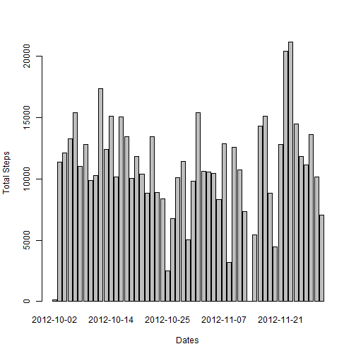
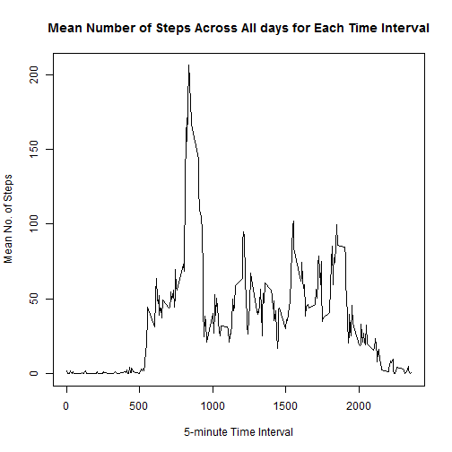
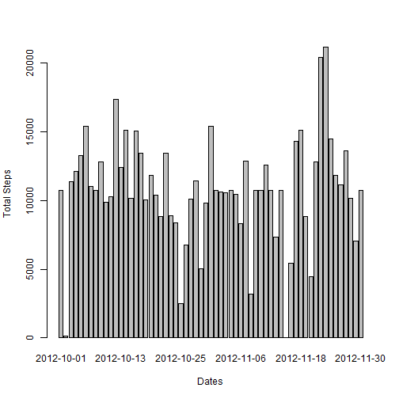
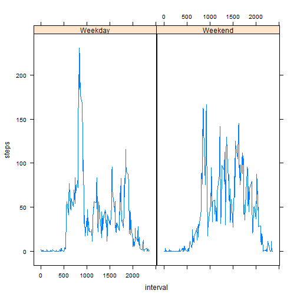

#Analysis of Activity
## Loading and preprocessing the data
The working directory fo the code is the directory where the data files "activity.zip resides". First data is read directly from the zip file into a data frame. 

```r
activitydata <- read.csv(unz("activity.zip", "activity.csv"), 
                        colClasses=c("numeric","Date","numeric"),
                        header=TRUE, sep=",", stringsAsFactors=FALSE)
```

## What is mean total number of steps taken per day?
Apply the 'sum' function to the steps column, aggregating rows based on unique date values.


```r
totalstepsday<-aggregate(steps~date, data=activitydata,sum)
```

The histogram plot of the total number of steps each day is shown below :

```r
barplot(totalstepsday$steps, names.arg=totalstepsday$date,ylab="Total Steps", xlab="Dates")
```

 


```r
meansteps <- mean(totalstepsday$steps)
mediansteps <- median(totalstepsday$steps)
```

The mean total number of steps taken each day is 1.0766189 &times; 10<sup>4</sup>.  
The median total number of steps taken each day is 1.0765 &times; 10<sup>4</sup>. 

## What is the average daily activity pattern?
First find the mean number of steps in each time interval calculated across all days :

```r
meanstepsalldays<-aggregate(steps~interval, activitydata, mean) 
highesactivityinterval <- meanstepsalldays[which.max(meanstepsalldays$steps),]$interval
```
The mean number of steps for each time interval calculated for all days is shown in the plot below :

```r
plot(meanstepsalldays$interval,
     meanstepsalldays$steps, 
     type='l', 
     xlab="5-minute Time Interval", 
     ylab="Mean No. of Steps", 
     main="Mean Number of Steps Across All days for Each Time Interval")
```

 

The interval with the highest activity is 835.

## Input missing values
First find the number of rows with NA :

```r
nrowsNA <- nrow(activitydata) - sum(complete.cases(activitydata))
```
The number of rows with NA in steps are **2304**.

Replace all days with NA in number of steps with the mean steps across all days. Create a new data table calld *filledactivitydata* to contain the filled data.

```r
datesNA<-activitydata[is.na(activitydata$steps),]$date
daysindata<-unique(activitydata$date)
filledactivitydata <- activitydata
for(i in 1:length(datesNA))
{
    filledactivitydata[filledactivitydata$date == 
                            datesNA[i],]$steps<-meanstepsalldays$steps
}
```


```r
filledtotalstepsday<-aggregate(steps~date, data=filledactivitydata,sum)
```

The histogram plot of the filled total number of steps each day is shown below :

```r
barplot(filledtotalstepsday$steps, names.arg=filledtotalstepsday$date,ylab="Total Steps", xlab="Dates")
```

 


```r
filledmeansteps <- mean(filledtotalstepsday$steps)
filledmediansteps <- median(filledtotalstepsday$steps)
```

The mean total number of steps taken each day from the filled data is 1.0766189 &times; 10<sup>4</sup>.  
The median total number of steps taken each day from the filled data is 1.0766189 &times; 10<sup>4</sup>.  

Although the mean value has remained the same, the median value now differs slightly from that calculated in the original dataset without the estimates added in.


## Are there differences in activity patterns between weekdays and weekends?
Next, a new column "daytype" is created which contains a factor of either one of two levels -- "Weekday" or "Weekend".

```r
dayofweek<-weekdays(filledactivitydata$date)
dayofweek[grepl("Sunday",dayofweek)] <- "Weekend"
dayofweek[grepl("Saturday",dayofweek)] <- "Weekend"
dayofweek[!grepl("Weekend",dayofweek)] <- "Weekday"
dayofweek <- as.factor(dayofweek)
filledactivitydata$daytype<-dayofweek
```

The mean number of steps in each time interval is then computed for the weekdays and separately for the weekends.

```r
meanstepsperinterval<-aggregate(steps~interval+daytype, data=filledactivitydata,mean)
```

Plotting the data for both weekdays and weekends :

```r
library(lattice)
xyplot(steps~interval|daytype,data=meanstepsperinterval,layout(1,2),type='l')
```

 

Note that the `echo = FALSE` parameter was added to the code chunk to prevent printing of the R code that generated the plot.
